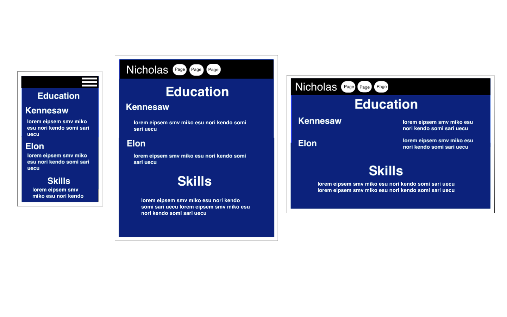
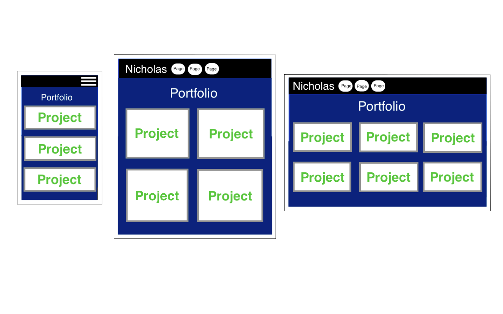
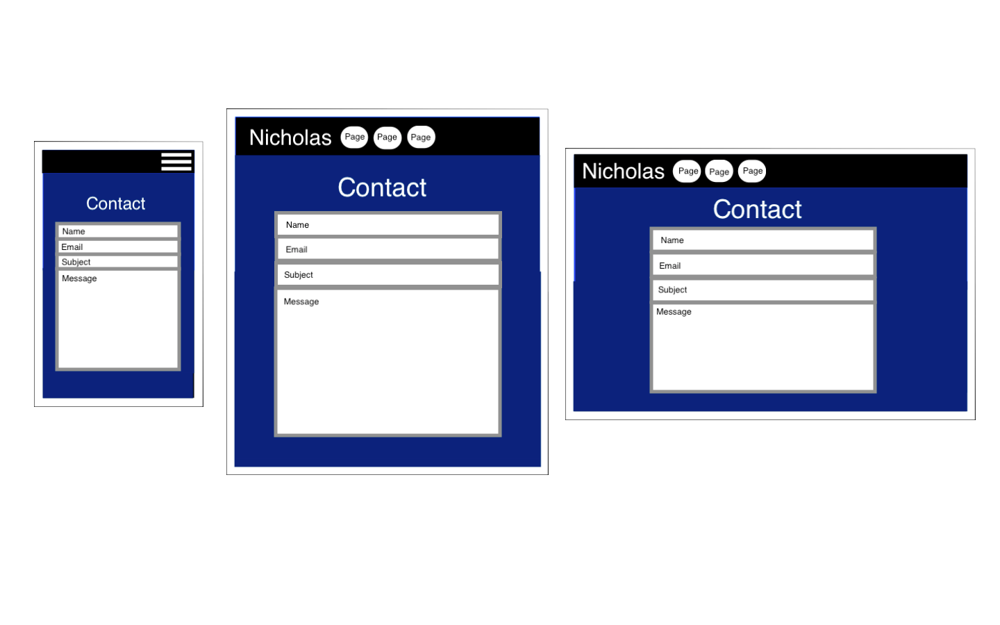

# Milestone Portfolio Project

The following project is an online portfolio to demonstrate my web development skills to potential clients. At the moment, I'm still relatively inexperienced so a lot of the site is just an overview of the code languages I'm familiar with. 

# UX

Ideally this site will allow users to get a better understanding of me on a professional level. The goal is to create four basic web pages devoted to that end:
- A homepage to introduce myself to the user and explain the purpose of the site.
- A page for explaining my and education and experience in web development.
- A portfolio page to present my work.
- A contact page for potential clients to reach out to me for work.

## Wireframes:

# Features
