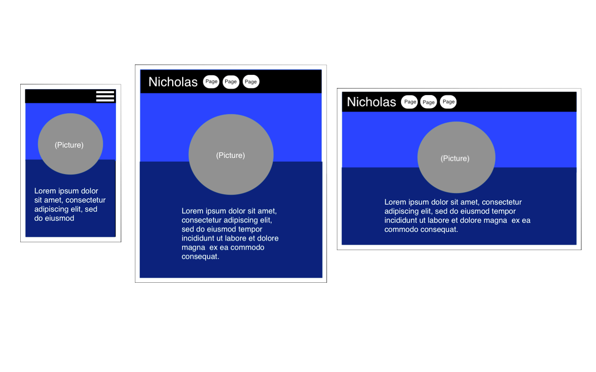

# Milestone Portfolio Project

The following project is an online portfolio to demonstrate my web development skills to potential clients. At the moment, I'm still relatively inexperienced so a lot of the site is just an overview of the code languages I'm familiar with. 

[View live project](https://nickspriggs.github.io/portfolio-project/)

# UX

Ideally this site will allow users to get a better understanding of me on a professional level. The goal is to create four basic web pages devoted to that end:
- A homepage to introduce myself to the user and explain the purpose of the site.
- A page for explaining my and education and experience in web development.
- A portfolio page to present my work.
- A contact page for potential clients to reach out to me for work.  

## User Stories

-   #### First Time Visitor Goals

    1. As a First Time Visitor, I'd like to get a comprehensive overview of who site the belongs to.
    2. As a First Time Visitor, I want to easily find different information about the users work history and experience      

-   #### Returning Visitor Goals

    1. As a Returning Visitor, I want to be able to see regular updates corresponding to changes in the owners work history in the time since my previous visit.

## Wireframes:

# Features

- Functions on mobile, desktop, and tablet.

- External links that redirect user to other pages.

- Certain elements that respond to user interactions.

# Technology Used

## Languages

- HTML
- CSS

## Frameworks, Libraries, Websites & Programs Used
- [Bootstrap](https://www.bootstrap.com/): This library provided examples of responsive code that were vital to the functionality of my project, such as the collapsable navigation bar and contact form.

- [Font Awesome](https://www.fontawesome.com/): This was very useful for styling the fonts of different text elements.

- [W3schools](https://www.w3schools.com/): The code on the site served as the template for several styling elements I had difficulty with.

- [Photoshop](https://photoshop.com/en): This was neccesary in order to create certain images and visual elements.

- [GitHub](https://github.com/): GitHub was the program used to design and ultimately launch the code for this project.

# Testing
This project utilized the W3C Markup Validator and W3C CSS Validator for testing the competency of the code on each page.

- WSC Markup - [Link to site](https://validator.w3.org/)
    - Index.html - <a href="assets/PDFs/Index - Success.pdf"> Results PDF </a>
    - Exeprience.html - <a href="assets/PDFs/Experience - Success.pdf"> Results PDF</a>
    - Portfolio.html - <a href="assets/PDFs/Portfolio - Success.pdf">Results PDF</a>
    - Contact.html - <a href="assets/PDFs/Contact - Success.pdf">Results PDF </a>
- W3C CSS - [Link to site](https://jigsaw.w3.org/css-validator/#validate_by_input)
    - Style.css - <a href="assets/PDFs/CSS - Success.pdf">Results PDF </a>

## Testing User Stories

-   #### First Time Visitor Goals
    1. As a First Time Visitor, I'd like to get a comprehensive overview of who site the belongs to.
        - The home page immediate introduces the reader to the site owner and provides clear direction to the other pages.
    2. As a First Time Visitor, I want to easily find different information about the users work history and experience.    
        -  All the links and external elements function clearly and are unambiguious in their purpose.

## Further Testing

- Project was tested in Chrome, Firefox, and Safari browsers.

# Deployment

I deployed the project on GitHub using the application GitHub Pages. The steps to do so were as follows:
1.  Log into your GitHub account. 
2.  Go to the repository containing the project.
3.  On the menu bar click the last item entitled "Settings" which will redirect you to the advanced settings page.
4.  Near the bottom of the page you'll find a section aptly titled "GitHub Pages"
5.  Under source change the dropdown menu from "None" to "Main". Then click "Save"
6.  The page will refresh autamatically and if you scroll back down you should see a link to the active site.

In order to make a clone follow the previous section up to step #2:
1.  Above the menu bar containing the "Settings" tab notice the three buttons to the right: "Unwatch", "Star", and "Fork".
2.  Click the "Fork" button and refresh your browser. You will now have a copy of the repository in your own account.
3.  If you have trouble locating the repository just return to the landing page of github and use the search bar.

# Credits

- Content
    - Text was written by the developer.

- Media
    - Background image was taken from [Arizon Commerical Professional Facebook](https://www.facebook.com/ArizonaCommercialProfessionals/) page
    - Main portrait image was created by the developer.

- Acknowledgements
    - Thank you to [Pascal Vangemert](http://www.pascalvangemert.nl/#/profile)  for providing inspiration for certain design choices
    - Thank you to Code Institute!